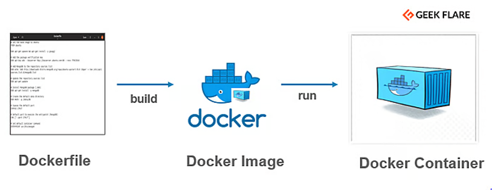

# Repositório para Descomplicar o Docker

Livro base é o [descomplicandoDocker](https://livro.descomplicandodocker.com.br/)

Conteiner não é Docker. Porém o Docker foi aquele populou essa forma de isolamento de processos. Por exemplo, o avó do Docker é o Shroot

## O que é conteiner?

[Ref de capítulo](https://livro.descomplicandodocker.com.br/chapters/chapter_01.html) 

Diferente de uma VM, não existe uma grande camada de abstração onde se isola todo uma parte do processamento do computador. O conteiner tem muito mais relação com **isolamento de processo**. Isolando também networking

De onde surgiu? A Dor de Gerenciar Diversas Máquinas.

Imagine um cenário em que você precisa gerenciar vários sistemas operacionais em diferentes máquinas físicas. Cada sistema exige atenção individual, desde a instalação e configuração até a manutenção e segurança. Essa multiplicidade de máquinas gera um problema de gestão:

Então a virtualização (ainda não o conteiner) foi a Solução para Isolamento e Gestão Eficaz. 

Isolamento: Cada VM é um ambiente isolado e seguro, sem interferência de outras VMs.
Gerenciamento Simplificado: Uma única interface centralizada facilita a gestão de todas as VMs.
Economia de Recursos: Otimiza o uso de hardware, energia e espaço físico.

**Docker: Evolução da Virtualização com Containers Leves:**

O Docker representa a próxima geração da virtualização, com foco em containers. O container é uma unidade leve que encapsula tudo o que é necessário para executar um aplicativo: código, bibliotecas, configurações e dependências. As principais vantagens do Docker são:

Portabilidade: Os containers podem ser facilmente transferidos entre diferentes ambientes, como desenvolvimento, teste e produção.
Eficiência: Otimizam o uso de recursos, pois compartilham o kernel do sistema operacional host.
Escalabilidade: Facilitam a replicação e o dimensionamento de aplicações.

**Compreendendo Imagens, Containers e Dockerfiles:**

* Imagem: É um modelo pré-configurado que define o ambiente do container. Imagine-a como a planta de uma casa, que define a estrutura e os elementos básicos.
* Container: É a instância real da imagem, como a casa construída a partir da planta. Vários containers podem ser criados a partir da mesma imagem.
* Dockerfile: É um arquivo que define as instruções passo a passo para construir a imagem. É como o manual de construção da casa, que detalha os materiais e as etapas necessárias.

**Exemplo Prático: Banco de Dados em um Container:**

Imagine que você precisa executar um banco de dados MySQL. Com o Docker, você pode:

1. Obter a imagem: Acessar o Docker Hub, um repositório com diversas imagens prontas para uso, e baixar a imagem oficial do MySQL.
2. Criar o container: Executar o comando docker run para criar um container a partir da imagem do MySQL.
3. Conectar-se ao banco de dados: Acessar o banco de dados através de um cliente MySQL, como o MySQL Workbench.
Isso é simples e escalável. 

**Conclusão**:

A virtualização e o Docker são ferramentas poderosas que simplificam a gestão de ambientes de TI. A virtualização oferece isolamento e gerenciamento eficaz de diferentes sistemas operacionais, enquanto o Docker leva a virtualização a um nível mais granular com containers leves e portáteis. A combinação dessas tecnologias contribui para a eficiência, escalabilidade e segurança de aplicações em diversos cenários.

## o que uma Imagem?

RESUMO: 
1. As imagens tem camadas;

2. Apenas a última camada do docker pode ser escrita;

3. Caso queira escrever em qualquer outra camada, essa será a cópia e não original;

Imagens são feita em camadas. Apenas a última camada do docker é read and writter, o resto é only read. Ou seja, tudo que está abaixo da útima camada (voltada a escrita), será copiado e reescrito em caso de necessidade de alteração. O docker copia o arquivo, traz para última camada e escreve na cópia. 
Então todas as camadas abaixo da read and writter são identicas, mas a camada de cima é aquela que tem informações diferentes, como logs.

**Exemplo prático**: caso você crie dois 'runs', um para realizar o apt-get install do requirements, e outro para limpar o cache, o da limpeza do cache não funcionará, porque apenas a última camada é read and writter, impossível de alterar camada anterior que é apenas only read.

Lembre-se, uma imagem dá luz a vários conteiner, ou seja, é a mesma imagem e a mesma informação, tanto que, 10 imagens docker com de 50GB ocupará apenas 50GB ao invés de meio Terabyte. Apenas é adicionado as informações que a última camada de read and writter, como os logs. 