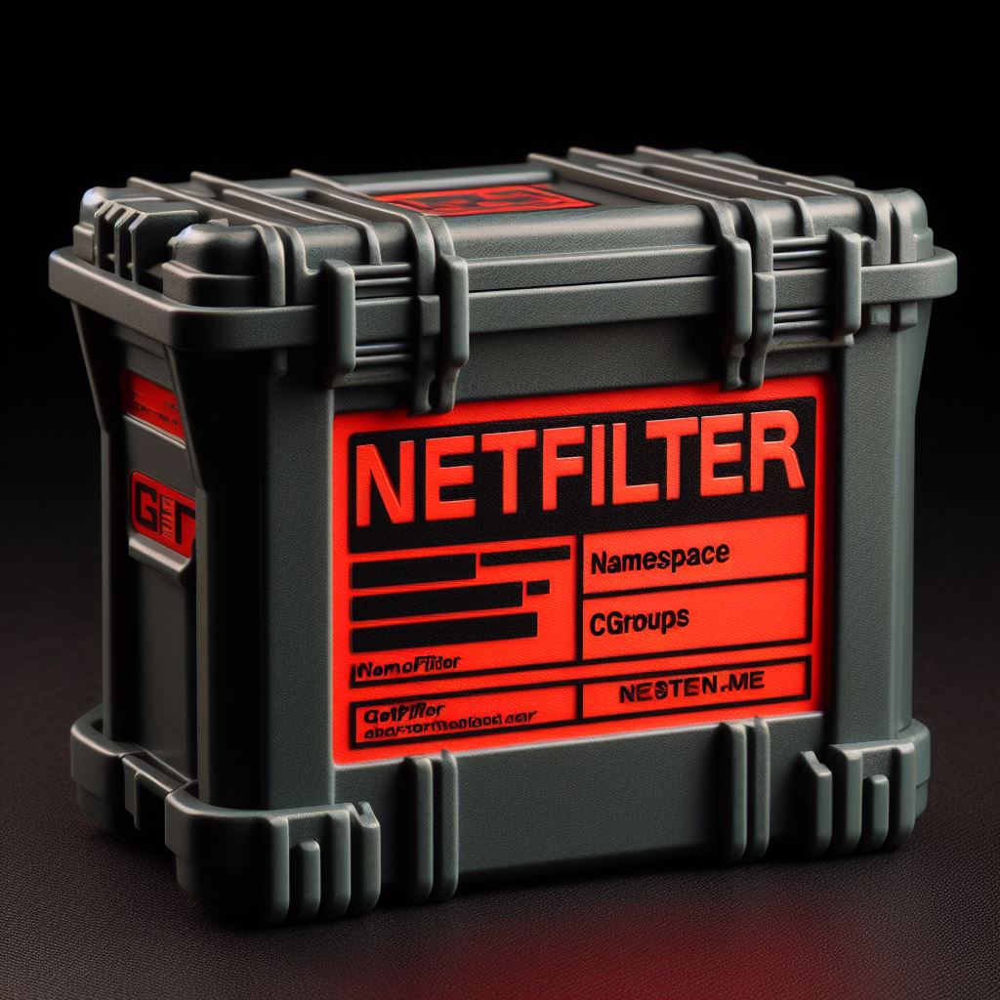

# Conceitos básicos do docker e instalação



### Conceitos 

**Namespace**:
Cada conteiner tem sua árvore de processos que não interfere na execução do outro. Além do PID namespace e Netnamespace, há outros namespaces, como o Mount namespace para isolar pontos de montagem, o UTS namespace para isolamento de hostname. 

"PID namespace: faz o isolamento dos processos, permitindo que os containers tenham seus próprios PID (como um aliás do PID original);
Net namespace: permite que cada container possua sua própria interface de rede e portas;
MNT namespace: permite que cada container tenha seu sistema de arquivos;
IPC namespace: garante o isolamento dos sistemas de arquivos criados pelo MNT namespace;
User namespace: garante o isolamento dos usuários em cada container;
UTS namespace: Isolamento de nome de domínios, hostname entre outros.

Os containers possuem suas próprias árvores de processos, interface de rede, portas, ip, sistema de arquivos, usuários, hostname entre outros. Tudo isso é provido pelos namespaces que isolam de forma que nenhum container pode/consegue interferir em outro. Portanto, containers: são grupos de processos isolados através dos namespaces onde o host conhece todos os processos de todos os containers, mas os containers enxergam/conhece apenas os seus próprios processos. Isso faz com que não se interfiram." [Andrade, Flávio, 2018. "Entendendo os containers do Docker"](https://medium.com/@flaviochess/entendendo-os-containers-do-docker-a4a481007885)

**Cgroups**:

Control Groups, são responsáveis por limitar, controlar, medir, contabilizar e isolar recursos de um grupo de processos. Eles são utilizados para limitar não apenas CPU e memória, mas também outros recursos como I/O de disco, largura de banda de rede, entre outros.

**Netfilter**:

Framework no kernel do Linux para manipulação de pacotes de rede e filtragem. No contexto de containers, o Docker utiliza o Netfilter para realizar a tradução de endereços (NAT) e permitir a comunicação entre o container e a rede externa. É importante destacar que o Netfilter não está diretamente relacionado à comunicação entre containers dentro do mesmo host. É mais comum referir-se ao serviço que gerencia as regras do Netfilter como iptables.


### Instalando docker

[Siga a documentação, é mais seguro!](https://docs.docker.com/engine/install/ubuntu/)
Detalhes no livro [descomplicando docker](https://livro.descomplicandodocker.com.br/chapters/chapter_03.html)
Tive problemas em relação a um pacote podman, resolvi arrancar: 


```sh
Unpacking docker-ce-cli (5:25.0.2-1~ubuntu.22.04~jammy) ...
dpkg: error processing archive /var/cache/apt/archives/docker-ce-cli_5%3a25.0.2-
1~ubuntu.22.04~jammy_amd64.deb (--unpack):
 trying to overwrite '/usr/bin/docker', which is also in package podman-docker 3
.4.4+ds1-1ubuntu1.22.04.2
dpkg-deb: error: paste subprocess was killed by signal (Broken pipe)
Errors were encountered while processing:
 /var/cache/apt/archives/docker-ce-cli_5%3a25.0.2-1~ubuntu.22.04~jammy_amd64.deb
E: Sub-process /usr/bin/dpkg returned an error code (1)
```

Realizei primeiro [esses passo indicados](https://docs.docker.com/engine/install/ubuntu/#uninstall-docker-engine), depois removi o tal do podman:

```sh
sudo apt remove podman
sudo apt autoclean && sudo apt autoremove
```