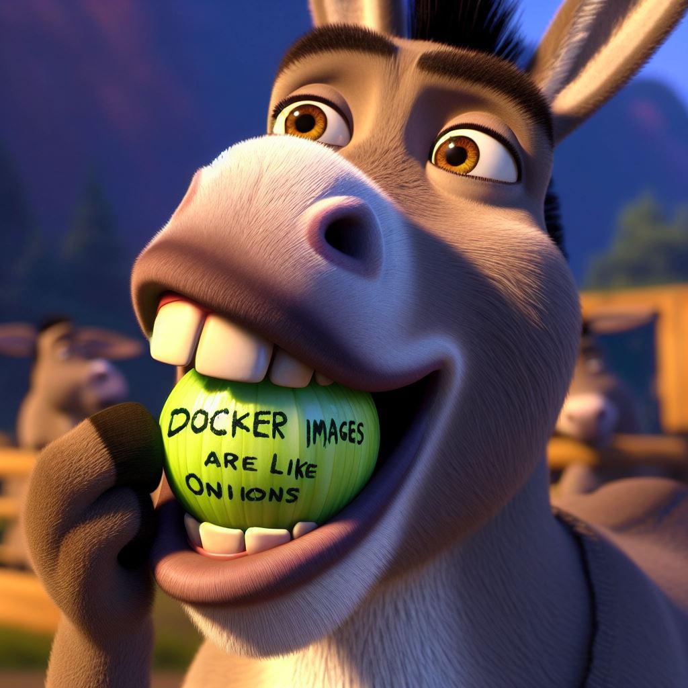

# O que sao imagens??

Imagens são feita em camadas. Apenas a última camada do docker é read and writter, o resto é only read. Ou seja, tudo que está abaixo da útima camada (voltada a escrita), será copiado e reescrito em caso de necessidade de alteração. O docker copia o arquivo, traz para última camada e escreve na cópia. 
Então todas as camadas abaixo da read and writter são identicas, mas a camada de cima é aquela que tem informações diferentes, como logs.

**Exemplo prático**: caso você crie dois 'runs', um para realizar o apt-get install do requirements, e outro para limpar o cache, o da limpeza do cache não funcionará, porque apenas a última camada é read and writter, impossível de alterar camada anterior que é apenas only read.

Escrever até mesmo um simples "a" em arquivos grandes pode causar certa degradação da performance, já que precisa ser copiado completamente para a 1ª camada.A partir disso surgiram novas soluções a fim de minimar o problema da cópia.

"A camada base (ready-only), a última camada da lista (de cima para baixo), é a camada de inicialização, é onde fica o kernel e o setor de inicialização bootfs, que é bastante similar ao sistema de inicialização raiz / do Linux/Unix. Nessa parte é onde temos toda a criação dos cgroups para fazer todo o controle de processos, namespace para blindar o container." [Álvares, Bernard, 2020. "As camadas que compõe uma docker image](https://medium.com/@bernard.luz/as-camadas-que-comp%C3%B5e-uma-docker-image-f77cfa7d04ce)

Lembre-se, uma imagem dá luz a vários conteiner, ou seja, é a mesma imagem e a mesma informação, tanto que, 10 imagens docker com de 50GB ocupará apenas 50GB ao invés de meio Terabyte. Apenas é adicionado as informações que a última camada de read and writter, como os logs. 